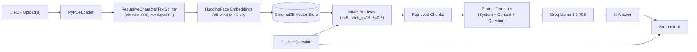

<p align="center">
  
</p>

<p align="center">
  <a href="https://pdf-rag-chat-awpbgzgzfmaauuewjkgara.streamlit.app/" target="_blank">
    
  </a>
</p>

<p align="center">
  <a href="#features">Features</a> ·
  <a href="#architecture">Architecture</a> ·
  <a href="#quick-start">Quick Start</a> ·
  <a href="#usage">Usage</a> ·
  <a href="#project-structure">Structure</a> ·
  <a href="#comparison">Comparison</a>
</p>

<p align="center">
  
  
  
  
  
  
  
  
</p>

---

Upload PDFs and ask questions using RAG with Chroma vector search and Groq LLM.

## Features

- **Multi-PDF Ingestion** — Upload one or more PDFs, search across all at once
- **RAG Pipeline** — Retrieve relevant chunks, generate grounded answers
- **MMR Retrieval** — Maximum Marginal Relevance for diverse, relevant context
- **Groq Llama 3.3 70B** — Fast, high-quality inference
- **ChromaDB** — Lightweight, local vector store (no external infra needed)

## Architecture



| Component | Stack |
|---|---|
| **Frontend** | Streamlit (chat interface) |
| **Document Loading** | PyPDFLoader + RecursiveCharacterTextSplitter |
| **Embeddings** | HuggingFace `all-MiniLM-L6-v2` |
| **Vector Store** | ChromaDB (local, in-memory per session) |
| **Retrieval** | MMR (k=5, fetch_k=15, lambda_mult=0.5) |
| **LLM** | Groq `llama-3.3-70b-versatile` |
| **Orchestration** | LangChain |

## Quick Start

```bash
git clone https://github.com/kairav7220/pdf-rag-chat.git
cd pdf-rag-chat
pip install -r requirements.txt
```

Set your API key in `.env`:

```env
GROQ_API_KEY="gsk_..."
```

```bash
streamlit run app.py
```

## Usage

1. Upload PDFs in the sidebar (multiple supported)
2. Wait for indexing to complete
3. Ask questions in the chat input
4. LLM responds using only the retrieved context — says "I don't know" if missing

## Comparison

| Feature | This Project | LangChain RAG Script | LlamaIndex |
|---|---|---|---|
| UI | ✅ Streamlit | ❌ CLI only | ❌ CLI only |
| Multiple PDFs | ✅ Single upload | ❌ One at a time | ✅ |
| MMR Retrieval | ✅ Built-in | ❌ Manual | ✅ |
| Vector Store | ChromaDB | Any | Any |


## Project Structure

```
pdf-rag-chat/
├── app.py              # Streamlit app (ingestion + chat)
├── requirements.txt    # Python dependencies
├── CONTRIBUTING.md     # Contribution guide
├── llms.txt            # AI assistant context
├── .gitignore
└── LICENSE
```

Single-file app — everything in `app.py` (under 120 lines).

## License

MIT © [kairav7220](https://github.com/kairav7220)

---

<p align="center">
  Built with <a href="https://python.langchain.com">LangChain</a> ·
  <a href="https://www.trychroma.com">ChromaDB</a> ·
  <a href="https://groq.com">Groq</a> ·
  <a href="https://huggingface.co/sentence-transformers">Sentence Transformers</a>
</p>
